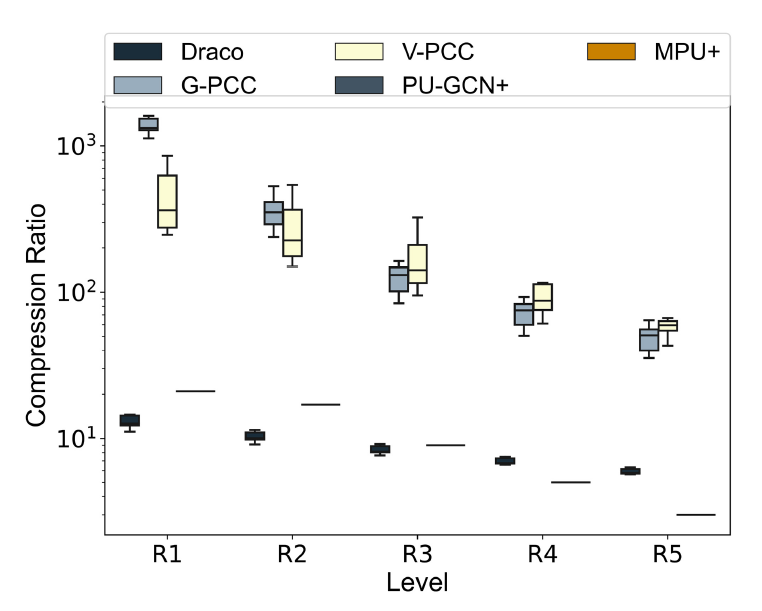
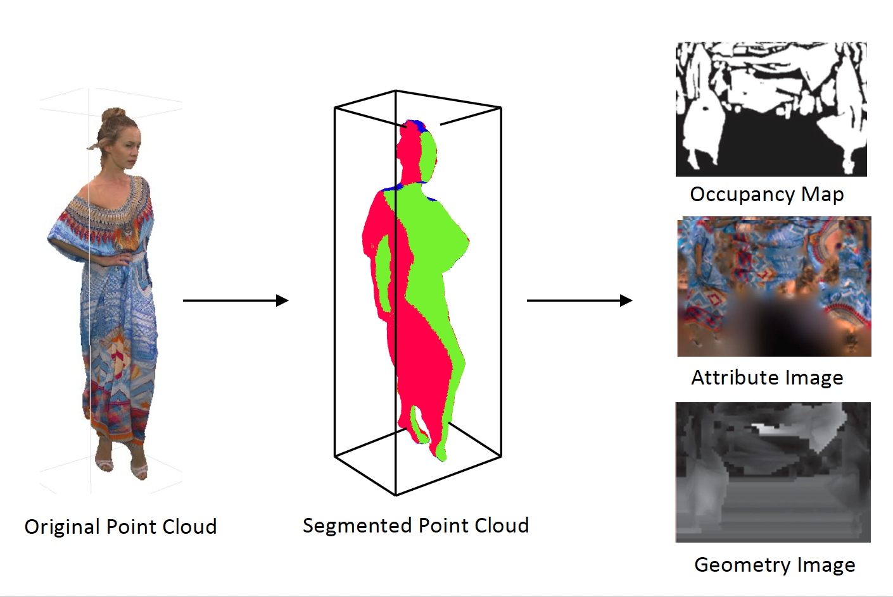
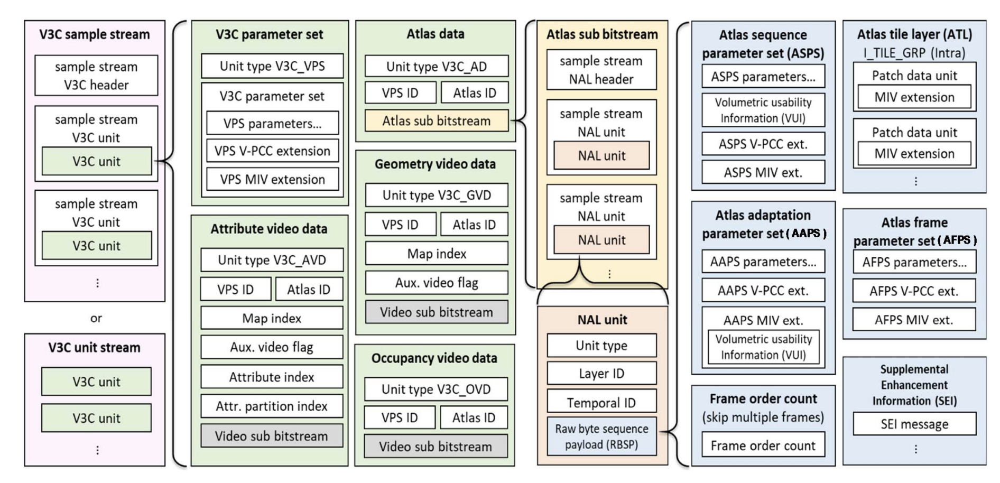

# Intro

Welcome to the MPEG V-PCC Volumetric Video Streaming Starter Kit! This repository is designed to help students and researchers get started with volumetric video streaming using MPEG V-PCC, also known as Video-based Point Cloud Compression.

Volumetric video is an emerging technology that allows viewers to experience video content in 3D, with the ability to move around and explore the scene from different perspectives. MPEG V-PCC is a standard developed by the Moving Picture Experts Group (MPEG) for compressing point cloud data, which is used to represent 3D objects and scenes in volumetric video.

This repository includes a variety of learning resources to help you understand the basics of volumetric video streaming with MPEG V-PCC, including:
- An overview of the MPEG V-PCC standard and its key features
- Tutorials and code samples for encoding, decoding, and streaming MPEG V-PCC content
- Links to relevant research papers and articles on the topic
- A list of tools and software that can be used for working with MPEG V-PCC and volumetric video

Whether you're a student just starting to explore the world of volumetric video, or a researcher looking to dive deeper into the technical details of MPEG V-PCC, this starter kit has something for you. We hope you find it helpful and informative, and we welcome your feedback and contributions to help make it even better.

# Index

- [Intro](#intro)
- [Index](#index)
- [MPEG V-PCC](#mpeg-v-pcc)
	- [How it works](#how-it-works)
	- [Bitstream Format](#bitstream-format)
	- [Vocabulary](#vocabulary)
- [Understanding V-PCC TMC2 code structure](#understanding-v-pcc-tmc2-code-structure)
	- [Configuration](#configuration)
	- [Source](#source)
		- [Samplestream and Bytestream](#samplestream-and-bytestream)
		- [Artifacts](#artifacts)
- [Links](#links)
	- [Papers](#papers)
	- [Presentation](#presentation)
	- [Software](#software)
	- [Datasets](#datasets)


# MPEG V-PCC

MPEG standardise two point cloud video compression methods: video-based point cloud compression (*V-PCC*) and geometry-based point cloud compression (*G-PCC*). Google proposed *Draco* which is a geometry-based compression technique. There are also several deep-learning based compression methods (e.g., PU-GCN+ and MPU+). The figure below shows the compression performance of different methods. In particular, by taking advantage of the successful 2D video compression techniques, V-PCC can achieve up to 100x better compression ratio compared with Draco, showing great potential for the applications of volumetric videos. The figure below is from [Yang et al.](https://ieeexplore.ieee.org/document/10050256), which shows the compression ratio of Draco, G-PCC, V-PCC, PU-GCN+, and MPU+.



## How it works

The main concept of V-PCC is to convert each frame of 3D point clouds into three different types of 2D images. These generated 2D images can be encoded using advanced video codecs like HEVC.

During the encoding process, the first step is *patch generation*, where the 3D point cloud is projected onto 2D space from various angles. Each point undergoes normal estimation and is assigned to a projection plane based on its normal direction. By default, the six faces of a bounding box serve as the projection planes. This projection segmentation divides the point cloud into patches, which are further refined to ensure connectivity in the projection. An example of a segmented point cloud with different colored patches is shown in the following figure.



Next, *patch packing* takes place, where the patches are sequentially placed onto 2D video frames while maintaining their relative positions and orientations across frames. The goal of patch packing is to effectively fit all the patches onto the 2D frames, allowing for efficient compression using existing video coding standards. This process involves applying a packing method followed by global patch allocation (GPA). After patch packing, V-PCC generates three artifacts: the *occupancy map* indicating pixel occupation in the resulting projection plane, the *geometry image* containing depth information between points and the projection plane, and the *attribute image* containing attributes like colors of the projected points. The figure shown above gives examples of these three artifacts. 

Finally, the resulting 2D video is encoded using a 2D video codec such as HEVC.

On the decoder side, the 2D video decoder decodes and reconstructs the occupancy map, geometry map, and attribute map. The geometry and attribute of the point cloud are then reconstructed. Post-processing techniques like duplicate pruning and smoothing are applied to refine the reconstructed point cloud. 

For more detailed information, please refer to the Section III-B of the report from [Graziosi et al.](https://mpeg-pcc.org/wp-content/uploads/2020/04/an_overview_of_ongoing_point_cloud_compression_standardization_activities_videobased_vpcc_and_geometrybased_gpcc.pdf).

## Bitstream Format

The V3C bitstream structure, is the format of the binary stream outputted by the encoder. Its spec is shown below. Feel free to skip this segment if you are not modifying encoder/decoder.



The standard specifies the V3C sample stream to concatenate V3C units into a single bitstream. Every V3C unit is composed of a header and a payload, where the first element of the header is the unit type. The current text of the standard specifies 5 unit types, namely the V3C
parameter set (VPS), atlas data (AD), geometry video data (GVD), attribute video data (AVD), and occupancy video data (OVD).

The VPS is an essential unit which signals the start of a new sequence and provides information that allows the decoder to setup, such as the atlas count, frame sizes, presence of unit types, map count (i.e., number of geometry layers), attribute count and definition, and so on. The VPS can either be provided in-band or out-of-band.

For other V3C units, the header links the unit to VPS and atlas by ID. In addition, GVD and AVD link to a map, and AVD also links to an attribute (e.g., texture) and attribute partition (i.e., set of video planes) by index.

The payload of GVD, AVD, and OVD units is a video sub-bitstream. The AD unit contains an AD sub-bitstream that is structured as a network abstraction layer (NAL) unit stream, which is a generic format suitable for use in both packet-oriented and bitstream-oriented systems.

Every NAL unit is either an atlas coding layer (ACL) NAL containing patch data or a non-ACL NAL. The atlas sequence parameter set (ASPS), atlas frame parameter set (AFPS), and atlas adaptation parameter set (AAPS) are non-ACL NAL units that carry infrequently changing information of the coded atlases in the V3C bitstream. The ASPS may also carry the volumetric usability information (VUI) which provides rendering hints. There are also NAL units that carry supplemental enhancement information (SEI) messages (like in HEVC).

**Endianness**. For bit-oriented delivery, the bit order for the sample stream format is specified to start with the MSB of the first byte, proceed to the LSB of the first byte, followed by the MSB of the second byte, etc. (Annex B, V-PCC standard). Hence, bitstream is big-endian, similarly for NAL stream.

## Vocabulary

The code/standard used a lot of abbreviations which are hard to figure out at first.

- rbsp (raw byte sequence payload), basically how the bytes are laid out in memory.
- SEI: supplemental enhancement information. This is mainly use for conformance trace etc.
- VUI: Video Usage Information
- NAL: Network Abstraction Layer. NALs help it easier to break up into network packets.
- Bounding box: a cuboid solid having six rectangular faces placed at right angles
- atlas: collection of 2D bounding boxes and their associated information placed onto a rectangular frame, corresponding to a volume in 3D space on which volumetric data is rendered 
- atlas sample: position on the atlas frame of the projected patches
	- atlas coordinates: two scalars (x, y) indicaitng the location of an atlas sample relative to the top left corner of an atlas frame
- atlas frame: 2D rectangular array of atlas samples onto which patches are projected + additional information related to patches corresponding to a volumetric frame
	- frame order count: used to identify and order atlas frames + decoder conformance checking
	- tile: independently decodable rectangular region of an atlas frame
	- AFPS (Atlas Frame Parameter Set): parameters that apply to an atlas frame
        - contains AFTI (Atlas Frame Tile Information)
- atlas sequence: collection of atlas frame
	- ASPS (Atlas Sequence Parameter Set): parameters that apply to an atlas sequence
- patch: rectangular region within an atlas associated with volumetric information
- [I, P, B frames](https://ottverse.com/i-p-b-frames-idr-keyframes-differences-usecases/)
	- I-frames (intra prediction only), P-frames (predicted from a frame that occurs before it in display order), B-frames (predicted from a frame that can occur before and after it in display order)
	- A GOP (Group of Pictures) generally starts with an I picture and has a sequence of P and B pictures. 
		- The distance between 2 successive I frames is called the length of GOP.
		- The distance between 2 successive P frames is called the length of mini-GOP.

# Understanding V-PCC TMC2 code structure

Here is an explanation of the reference software [MPEG-VPCC-TMC2](https://github.com/MPEGGroup/mpeg-pcc-tmc2) codebase. To encode / decode, we usually use our [driver script](./script/tmc2.sh)

## Configuration

The `/cfg` folder contains all the configurations for each dataset. It is divided into several folders (common, sequence, etc).

Some of the notable parameters in the `common` configuration are 
- `minimumImageWidth` and `minimumImageHeight`
    - These parameters set the initial projection height and width. The encoder will automatically extend them if the projections doesn't fit.
    - However, if these parameters are set too low, you might encounter segmentation fault during encoding process.
    - If your resulting (decoded) point cloud looks distorted, you might want to increase this also. 
- `profileReconstructionIdc`: this set whether the advanced features of the encoder / decoder is used.

The `hm`, `jm`, `shm` folder contains configuration for the HM (H.265), JM (H.264) and SHM (H.266) respectively. 

The `sequence` folder contains configuration for each dataset. You probably need to adjust the `uncompressedDataPath` attribute - this is relative path from your datasets folder.

The `rate` folder contains the configuration for compression quality. 
The lower the QP values go, the less lossy it gets (lower compression rate). Occupancy precision is used to downsample the Occupancy Data (OVD) - values of 2 or 4 is acceptable.

Please refer to [MPEG V-PCC parameters](./doc/README.parameters.pdf) for the descriptions of parameters of the encoder, decoder and metrics programs.

## Source

The `source/app` folder contains the code for the binaries, which makes use of the library code in `source/lib`. 

Throughout the codebase, videoXXX refers to the 2D video tools, such as HM or JM. So, VideoDecoder.cpp is a wrapper around the backing 2D video decoder(s).

The implementation makes use of `viewId`. This are IDs for each of the projection plane. The simplest version makes use of 6 projection planes, namely 0 (left), 1(bottom), 2(back), 3(right), 4(top), 5(front).

The reference codebase is quite hard to read (e.g. passing everything by non-const reference) so I recommend reading it side-by-side with the [Rust port](https://github.com/benclmnt/tmc2-rs)

### Samplestream and Bytestream

In the code, you will find the notion of sample stream and wonder how it relates to bytestream.

Sample stream is what is multiplexed in the combined bitstream. However, the decoder only understands the bytestream. so
-  `sample_stream_to_byte_stream` is used in PCCDecoder on the bitstream before being send to the `VideoDecoder::decode` 
- `byte_stream_to_sample_stream` is used in PCCEncoder on the bitstream after the call to `VideoEncoder::encode`

### Artifacts

The encoding/decoding process can be set to output intermediate files (via `--keepIntermediateFiles` option). These intermediate files can prove useful for inspection and debugging.

You can use ffmpeg to process the original bitstream. For example, you can decode `S26C2AIR02_F100_GOF0_attribute.bin` (which contains only the AVD part of the bitstream) to view the raw YUV video.
- Decode: `ffmpeg -y -i S26C2AIR02_F100_GOF0_attribute.bin out.yuv`
	- h264: ~ 0.53s (on battery), 2.4M bin file
	- h265/hevc: ~ 1.05s (on battery), 732k bin file
- Encode: frame rate is 30 by default (will create 64 frames for the attribute). You would need to specify the height and width (via `-s` flag; values are from the filename)

```
# JM / h264 
ffmpeg -s 1280x1344 -i /path/to/folder/S26C2AIR02_F100_GOF0_attribute_1280x1344_8bit_p420.yuv -an -vcodec libx264 -qp 28 /path/to/folder/gof0_attr.mp4

# HM / HEVC / h265 
ffmpeg -s 1280x1344 -i /path/to/folder/S26C2AIR02_F100_GOF0_attribute_1280x1344_8bit_p420.yuv -an -vcodec libx265 -qp 32 /path/to/folder/gof0_attr.mp4
```

You will also note that the size of the occupancy (OVD) files are much smaller than the geometry (GVD) / attribute (AVD) files. This is because the GVD/AVD files have twice as many frames (1 extra P-slice interleaved for every frame) and the dimension of OVD are smaller due to being sampled down (via `--occupancyPrecision` parameter)


# Links

## Papers

- [V-PCC Standard](./doc/vpcc-standard.pdf)
- Graziosi, Danillo, et al. "An overview of ongoing point cloud compression standardization activities: Video-based (V-PCC) and geometry-based (G-PCC)." APSIPA Transactions on Signal and Information Processing 9 (2020): e13. [Download](https://mpeg-pcc.org/wp-content/uploads/2020/04/an_overview_of_ongoing_point_cloud_compression_standardization_activities_videobased_vpcc_and_geometrybased_gpcc.pdf)
- Boyce, Jill M., et al. "MPEG immersive video coding standard." Proceedings of the IEEE 109.9 (2021): 1521-1536.

## Presentation

The works done by NUS students and researchers on V-PCC are listed below.

- Clement, Bennett, Yuang Shi, and Wei Tsang Ooi. "Viewpoint-Aware VPCC-Encoded Volumetric Video Streaming." NUS Final Year Project. [Slides](https://docs.google.com/presentation/d/17XZR0LGsCXr_oeGWOZZG8T9m_TVTAT3XVpjtUIh-1VA/edit?usp=sharing)
- Shi, Yuang, et al. "Enabling Low Bit-Rate MPEG V-PCC-encoded Volumetric Video Streaming with 3D Sub-sampling." Proceedings of the 14th Conference on ACM Multimedia Systems. 2023. [Slides](./doc/MMSys'23-Enabling-Low-Bit-Rate-MPEG-V-PCC-encoded-Volumetric-Video-Streaming-with-3D-Sub-sampling.pptx)

## Software

- [TMC2 reference software in C++](https://github.com/MPEGGroup/mpeg-pcc-tmc2): the official V-PCC reference software.
- [TMC2 in Rust](https://github.com/benclmnt/tmc2-rs): a rust port that is 15x faster.
- [VVTk](https://github.com/nus-vv-streams/vvtk/tree/main): a Toolkit for Volumetric Video Researchers developed. 
- [Web-based point cloud renderer](https://github.com/mmspg/point-cloud-web-renderer): the renderer supports visualization of point clouds with real-time interaction in Web.

## Datasets

- Volumetric Video Dataset
  - [8i dataset](http://plenodb.jpeg.org/pc/8ilabs/)
    - This is the main dataset widely used by researchers.
  - [MPEG's surface-light-field volumetric video datasets](https://mpeg-pcc.org/index.php/pcc-content-database/8i-voxelized-surface-light-field-8ivslf-dataset/)
      - high quality dataset (3million points per frame)
      - each ply file is ~500MB because they contain a lot of data that we don't need, e.g. normals. A stripped out version will be much smaller.
  - Microsoft [released](https://plenodb.jpeg.org/pc/microsoft) some low and high quality **upper-body** datasets.
      - Sarah9 : 300k points per frame -> low quality
      - Andrew10: 1.3m points per frame -> higher quality
  (In comparison longdress has 700k points per frame)
  - [3D PointCloud DB - CMU Panoptic Dataset](https://domedb.perception.cs.cmu.edu/ptclouddb.html)
  - [MPEG's mesh volumetric video datasets](https://mpeg-pcc.org/index.php/pcc-content-database/owlii-dynamic-human-textured-mesh-sequence-dataset/)
  - [A Dynamic 3D Point Cloud Dataset for Immersive Applications](https://dl.acm.org/doi/abs/10.1145/3587819.3592546). 
    - A dynamic 3D point cloud dataset with motion ground truth.

- Volumetric Video Quality Assessment Dataset
  - [VOLVQAD](https://dl.acm.org/doi/10.1145/3587819.3592543)
    - An MPEG V-PCC volumetric video quality assessment dataset consisting 7,680 ratings on 376 video sequences from 120 participants.
